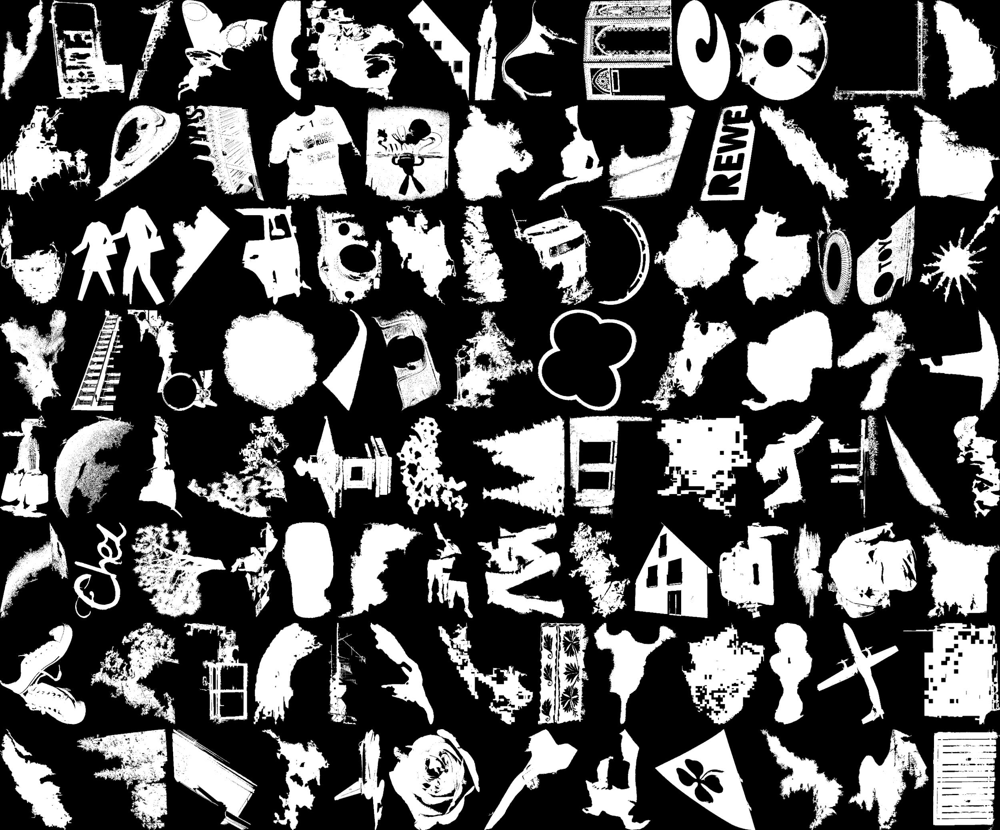

# Automatic Extraction natural 2D shapes from images 

## Extracting shapes from images: ExtractShape.py

ExtractShape.py run over folder of images and extract 2D shapes, should run out of the box with the supplied sampled folders.
This will generate an unlimited amount of 2D shapes, 12,000 extracted shapes can be downloaded from [this url.](https://drive.google.com/file/d/1Mb6aYvcwqRGdydCY7AFdvs1zwR8JpOwQ/view?usp=drive_link)  

## Creating shape matching test: Create_Scene_Shape.py

Create_Scene_Shape.py will images of the same shape but with different orientations/textures/color/backgound, this can be used for the 2D shape matching tests.

## Creating texture matching test: Create_Scene_Textures.py

Create_Scene_Textures.py will create images of the same texture but deploy on different 2D shapes and with different background, this can be used for the textures matching tests. 
